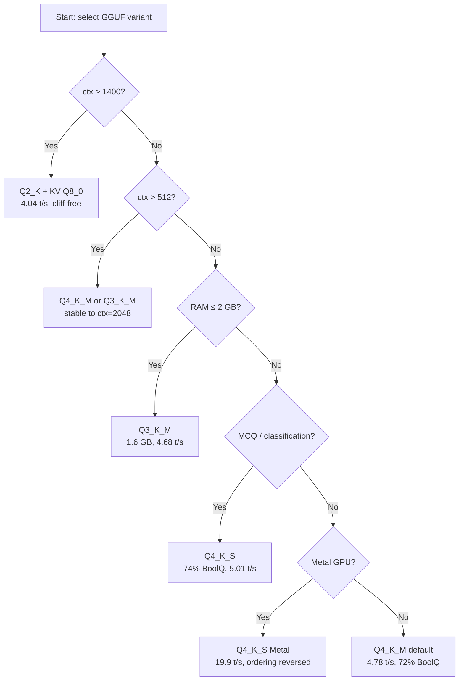

# Figure Specifications — Missing / Camera-Ready Figures
## EdgeLLMBench / GGUF K-Quant Paper

**Status:** Data complete. Figures listed below are either missing from the paper or
need to be reproduced as vector PDF (currently PNG). All data sources verified against
raw JSONL.

---

## Existing PNG Figures (Need Vector PDF Conversion)

**Action for all existing figures:** Re-run matplotlib with `plt.savefig('fig_name.pdf')`,
consistent 10pt sans-serif font (e.g., `rcParams['font.size'] = 10`), no title text
(caption carries the title), and a color-blind-safe palette.

Palette recommendation (ColorBrewer):
- Q2_K: `#d73027` (red)
- Q3_K_M: `#f46d43` (orange-red)
- Q4_K_S: `#fdae61` (orange)
- Q4_K_M: `#4575b4` (blue) — **default/recommended**
- Q5_K_M: `#74add1` (light blue)
- Q6_K: `#313695` (dark blue)
- Q8_0: `#1a9641` (green)

Current PNG list (all in `report/figures/`):
- `decode_tps_vs_ctx.png` → `decode_tps_vs_ctx.pdf`
- `kv_cliff.png` → `kv_cliff.pdf`
- `pareto_frontier.png` → `pareto_frontier.pdf`
- `size_vs_tps.png` → `size_vs_tps.pdf`
- `ppl_vs_acc.png` → `ppl_vs_acc.pdf`
- `memory_footprint.png` → `memory_footprint.pdf`
- `latency_dist.png` → `latency_dist.pdf`
- `prefill_decode_fraction.png` → `prefill_decode_fraction.pdf`
- `quality_full.png` → `quality_full.pdf` (if this is a figure; may be table-only)

---

## New Figures Needed (Not Yet in Paper)

### Figure G1: Cache Hierarchy + Cliff Mechanism Diagram

**What it shows:** Qualitative diagram (not a plot) showing:
1. Left panel: ARM Cortex-X1 memory hierarchy (L1 48KB → L2 512KB → DRAM 6GB LPDDR5)
   with the KV working set arrow showing "at ctx=512: 512×4096 bytes = 2MB total / 4 threads = 512KB ≈ L2"
2. Right panel: x86 i5-1235U hierarchy (L1 48KB → L2 1.25MB → L3 12MB → DRAM)
   with "at ctx=1280: 1280×4096 bytes = 5MB total / 4 threads ≈ 1.25MB ≈ L2"

**Purpose:** Makes the `L2/1024` formula intuitive. Shows visually why ARM cliff is at
512 tokens and x86 cliff is at 1280 tokens.

**Data:** No data file needed — construct from:
- ARM L2 = 512KB (Cortex-X1 spec)
- x86 L2 = 1.25MB (i5-1235U spec)
- C_layer formula: 4096 × ctx bytes, 28 layers → total = 28 × 4096 × ctx ≈ 114KB per ctx token
- Working set at cliff ≈ threads × L2 (or effective L2 per core)

**Tool:** matplotlib with `matplotlib.patches` (boxes and arrows), or draw.io / Figma.
No raw data needed.

**Suggested filename:** `figures/cache_hierarchy_diagram.pdf`

**LaTeX label:** `\label{fig:cache_hierarchy}`
Insert location: §6 Root Cause, immediately before the cliff threshold formula derivation
(after the KV-cache working set paragraph, around line ~975–990).

---

### Figure G2: SIMD Dequantization Pipeline Comparison

**What it shows:** Side-by-side operation count diagram for Q2_K vs Q6_K:
- Q2_K inner loop: 4 ops/block (vld1, vtbl, vand, vaddw)
- Q6_K inner loop: 9 ops/block (vld1×3, vshr, vand×2, vzip, vtbl, vaddw)
- Bar chart: X-axis = GGUF variant (Q2_K through Q8_0), Y-axis = NEON ops per 256-weight block
- Color: Q6_K bar highlighted in red (the anomaly); Q2_K in green (fastest)

**Data source:** Table 2 in paper (SIMD instruction count table, `\label{tab:superblock}`).
Verified values (static analysis, llama.cpp commit b1-1a29907):

| Variant | NEON ops/block | Notes |
|---------|---------------|-------|
| Q2_K   | 4  | Simple table lookup, fits L1 |
| Q3_K_M | 7  | Moderate complexity |
| Q4_K_S | 6  | Nibble extraction, AVX2-optimized |
| Q4_K_M | 6  | Same as Q4_K_S |
| Q5_K_M | 8  | 5-bit unpack with shift |
| Q6_K   | 9  | Split-bit layout (ql+qh), 6-operand shuffle |
| Q8_0   | 3  | Trivial 8-bit load, no dequant |

**Note:** Q8_0 is slow at TPS despite 3 ops because weight footprint is 3.4GB → DRAM bandwidth bound.
Include annotation: "Q8_0: DRAM-bound, not dispatch-bound"

**Tool:** matplotlib bar chart with annotation.

**Suggested filename:** `figures/simd_ops_comparison.pdf`

**LaTeX label:** `\label{fig:simd_ops}`
Insert location: §6.1 SIMD Dequantization Overhead, replacing or supplementing Table 2.

**Code skeleton:**
```python
import matplotlib.pyplot as plt
import numpy as np

variants = ['Q2_K', 'Q3_K_M', 'Q4_K_S', 'Q4_K_M', 'Q5_K_M', 'Q6_K', 'Q8_0']
ops      = [4,      7,        6,        6,        8,        9,     3    ]
colors   = ['#1a9641','#f46d43','#fdae61','#4575b4','#74add1','#d73027','#aaaaaa']

fig, ax = plt.subplots(figsize=(5, 3))
bars = ax.bar(variants, ops, color=colors, edgecolor='black', linewidth=0.5)
ax.set_ylabel('NEON ops per 256-weight block', fontsize=10)
ax.set_xlabel('Quantization variant', fontsize=10)
ax.annotate('DRAM-bound\n(not dispatch)', xy=(6, 3), xytext=(5.5, 7),
            arrowprops=dict(arrowstyle='->', color='gray'),
            fontsize=8, color='gray', ha='center')
ax.annotate('← slowest TPS\n(9 ops/block)', xy=(5, 9), xytext=(4.5, 9.5),
            arrowprops=dict(arrowstyle='->', color='#d73027'),
            fontsize=8, color='#d73027')
plt.tight_layout()
plt.savefig('figures/simd_ops_comparison.pdf')
```

---

### Figure G3: Cross-Platform Throughput Rank Chart

**What it shows:** Rank chart (bump chart or grouped bars) showing variant ordering
across 4 platforms:
- ARM Pixel 6a (CPU): Q2_K=7.49, Q4_K_S=5.01, Q4_K_M=4.78, Q3_K_M=4.68, Q8_0=4.52, Q5_K_M=3.75, Q6_K=3.53
- x86 i5-1235U (CPU): Q2_K≈14.05, ordering similar to ARM (Q2_K fastest, Q6_K slowest)
- M4 Mac (CPU, ngl=0): values from `results/m4_cpu_tps_*/` — see Table in paper
- M4 Mac (Metal GPU): Q4_K_S≈19.88, Q4_K_M≈18.5, Q3_K_M≈17.8, Q5_K_M≈15.8, Q2_K≈12.7, Q8_0≈6.3, Q6_K lowest

**Key visual claim:** Lines CROSS between CPU and Metal columns — Metal reverses ordering
entirely (Q4_K_S/Q4_K_M best on Metal, Q2_K best on CPU).

**Data source:**
- ARM: `results/pixel_llama_tps_20260325_120022/` ctx=256 decode_tps
- x86: `results/x86_tps_results.json` decode_tps field
- M4 CPU: `results/m4_cpu_tps_*/` tg128 rows (test_type='tg')
- M4 Metal: `results/m4_llama_tps_20260326_001546/` test_type='tg', n_prompt=128

**Format options:**
- Option A: Grouped bar chart (4 bars per variant, 7 variant groups)
- Option B: Bump chart — 4 columns (one per platform), lines connect same variant across platforms
  (Option B is more visually striking for showing rank reversal)

**Tool:** matplotlib.

**Suggested filename:** `figures/cross_platform_rank.pdf`

**LaTeX label:** `\label{fig:cross_platform_rank}`
Insert location: §8 Cross-Device Validation (around line ~1153), replacing or supplementing
Table 4 (the 4-platform TPS table).

---

### Figure G4: Deployment Decision Flowchart

**What it shows:** A flowchart (decision tree) for variant selection:
```
START: What are your constraints?
  ├─ ctx > 1400 tokens?
  │    ├─ YES → Q2_K + KV Q8_0 (cliff eliminated; -46% at short ctx)
  │    └─ NO → continue
  ├─ ctx > 512 tokens (extended context)?
  │    ├─ YES → Q4_K_M or Q3_K_M (stable to ctx=2048, cliff <-12%)
  │    └─ NO → continue
  ├─ RAM ≤ 2 GB?
  │    ├─ YES → Q3_K_M (1.6GB, cliff-resistant, >4 tok/s)
  │    └─ NO → continue
  ├─ MCQ / classification tasks (HellaSwag-type)?
  │    ├─ YES → avoid Q2_K (format collapse); use Q4_K_S (directionally highest BoolQ)
  │    └─ NO (generative, chat) → Q4_K_M (best all-round balance)
  ├─ Metal GPU backend (M4/M3)?
  │    └─ YES → Q4_K_S (Metal reverses CPU ordering; 19.9 tok/s)
  └─ Default / no special constraint → Q4_K_M (4.78 tok/s, 72% BoolQ)
```

**Note:** This is a supplementary visualization of Table \ref{tab:deployment}.
The decision table already exists in the paper; this figure adds the flowchart view.

**Tool:** matplotlib with `matplotlib.patches.FancyBboxPatch` + arrows, or
draw.io / Mermaid.js (can render to SVG then convert to PDF with `cairosvg`).

**Mermaid source:**


**Suggested filename:** `figures/deployment_flowchart.pdf`

**LaTeX label:** `\label{fig:deployment_flowchart}`
Insert location: §9 Deployment Recommendations, after the deployment decision table.

---

## Summary Checklist

| Figure | Status | Data Ready | Action |
|--------|--------|-----------|--------|
| All existing PNGs | ⚠️ PNG | ✅ | Re-save as PDF with consistent font |
| G1: Cache hierarchy diagram | ❌ Missing | ✅ (compute from specs) | Create in matplotlib or draw.io |
| G2: SIMD ops bar chart | ❌ Missing | ✅ (Table 2 values) | ~20 lines matplotlib |
| G3: Cross-platform rank chart | ❌ Missing | ✅ (all 4 platforms) | Need M4 CPU cliff data first (run `m4_cpu_cliff.sh`) |
| G4: Deployment flowchart | ❌ Missing | ✅ (Table deployment) | draw.io / Mermaid → PDF |

**Priority order:** G2 (easiest, highest impact) → G1 (explains cliff formula) → G3 (after M4 CPU data) → G4 (polish)

**Note on M1 (vector conversion):** When re-exporting existing figures, ensure:
- `plt.rcParams.update({'font.size': 10, 'axes.titlesize': 10, 'font.family': 'sans-serif'})`
- Remove `plt.title(...)` calls — LaTeX caption carries the title
- `plt.tight_layout()` before `plt.savefig('fig.pdf', bbox_inches='tight', dpi=300)`
- Color-blind-safe palette above (or seaborn's `colorblind` palette)
